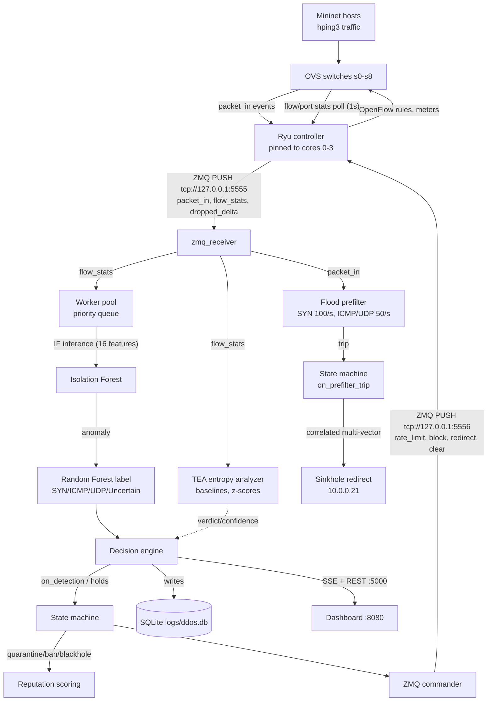

# ADDOS: Anomaly-Based DDoS Detection and Mitigation in Software Defined Networks

**ADDOS** is an end-to-end research testbed that detects and mitigates Layer 3/4 DDoS attacks entirely inside a software-defined network. It combines a packet-level flood prefilter, a temporal entropy analyzer (TEA), and two machine learning models (Isolation Forest for anomaly detection, Random Forest for attack-vector classification) into a single detection pipeline, then feeds every confirmed attacker through a per-IP mitigation state machine with persistent behavioral reputation scoring.

The whole system runs as a simulation on one Linux machine: Mininet emulates the network, hping3 generates baseline and attack traffic, a Ryu controller bridges the data plane to the detection backend over ZeroMQ, and mitigation decisions are pushed back down as OpenFlow rules. A web dashboard provides live monitoring, an Expert Mode view of pipeline internals, and PDF report generation.

## Table of Contents

- [Overview](#overview)
- [Architecture](#architecture)
- [How Detection Scoring Works](#how-detection-scoring-works)
  - [Flood Prefilter (sub-second fast path)](#flood-prefilter-sub-second-fast-path)
  - [TEA: Temporal Entropy Analysis](#tea-temporal-entropy-analysis)
  - [Isolation Forest anomaly scoring](#isolation-forest-anomaly-scoring)
  - [Random Forest attack classification](#random-forest-attack-classification)
  - [Decision fusion](#decision-fusion)
- [Severity and Priority Classification](#severity-and-priority-classification)
- [Mitigation Lifecycle](#mitigation-lifecycle)
  - [Phases](#phases)
  - [Behavioral reputation scoring](#behavioral-reputation-scoring)
  - [Escalation and release logic](#escalation-and-release-logic)
  - [Deception sinkhole](#deception-sinkhole)
- [Design Decisions](#design-decisions)
- [Setup and Usage](#setup-and-usage)
- [Project Structure](#project-structure)

## Overview

The system targets three weaknesses found in most simple DDoS defenses:

1. Reaction time. OpenFlow flow statistics are polled once per second, so a detector driven only by those counters reacts after the flood has already saturated the switch. ADDOS adds a packet-in-level prefilter that trips within tens of milliseconds and moves suspect IPs to the front of the ML queue.
2. Label cost. Supervised classifiers need labeled attack examples and are expensive to run on every flow. Here the Isolation Forest, trained only on normal traffic, acts as an unsupervised gate, and the Random Forest runs exclusively on flows the Isolation Forest flagged, labeling them as SYN, ICMP, or UDP flood.
3. False positives. Flash crowds and legitimate traffic spikes look statistically similar to floods. TEA tracks entropy and variance baselines of live traffic so that mitigation can be held back when the deviation looks organic rather than generated, and uncertain verdicts are diverted to a deception sinkhole rather than banned outright.

Attack types covered: SYN flood, ICMP flood, UDP flood, and spoofed-source variants. All mitigation operates at Layer 3/4 (IP addresses, protocols, ports, rate meters); there is no application-layer inspection by design (see [design decisions](#design-decisions)).

## Architecture

Four cooperating processes run on one host:

| Tier | Path | Stack | Role |
|---|---|---|---|
| Topology/testbed | `topology/topology.py` | Mininet, OVS, hping3 | Builds a star network of 9 switches, generates baseline and attack traffic, drives experiments |
| Controller | `controller/ryu_controller.py` | Ryu (OpenFlow 1.3) | Forwards packets via src-microflow rules, polls flow/port stats every second, pushes telemetry up, installs mitigation rules down |
| Backend | `backend/` | Flask, ZeroMQ, SQLite, scikit-learn | Telemetry ingestion, ML inference, decision engine, mitigation state machine, persistence, REST/SSE API |
| Frontend | `frontend/` | FastAPI, Chart.js, Jinja2 | Monitoring dashboard served on port 8080; browser talks directly to the backend API |

Model artifacts ship pretrained under `models/` (Isolation Forest and Random Forest joblib files plus feature-contract JSONs).

### End-to-end data flow



### Wiring

`backend/main.py` is the only place singletons get connected (`create_app()`):

1. `loader.load_all()` loads the IF and RF models and their feature contracts from `models/`.
2. SQLite schema is created/migrated (`logs/ddos.db`, WAL mode).
3. Singletons are wired: `state_machine.set_commander(...)`, `deception.set_commander(...)` plus callbacks that let the sinkhole escalate into `state_machine.on_detection()`, and `resource_guard` wiring.
4. Background daemon threads start: the state-machine tick loop (1s), system monitor (~1s), decision engine worker pool, ZMQ receiver, DB writer flush (5s batch), and the hourly hot-to-archive rotator.
5. Flask blueprints register (stats, ip_detail, graph, events, quarantine/mitigation, report, expert).

The app runs threaded (`app.run(..., threaded=True)`), which is required so Server-Sent Events can stream alongside ordinary endpoints.

## How Detection Scoring Works

Detection works in four layers: a packet-level flood prefilter, global entropy analysis (TEA), Isolation Forest anomaly scoring, and Random Forest classification. They are described below from fastest to slowest.

### Flood prefilter (sub-second fast path)

`backend/pipeline/flood_prefilter.py`. Per `(src_ip, protocol)` sliding windows over packet-in events:

| Protocol | Trip threshold | Window |
|---|---|---|
| TCP SYN | 100 packets | 1.0s |
| ICMP | 50 packets | 1.0s |
| UDP | 50 packets | 1.0s |

Two trip conditions fire per packet (`flood_prefilter.py:89-100`):

- the full-window limit is reached, or
- a burst occurs: at least 40% of the limit (minimum 2 packets) lands inside a 0.1s or 0.5s sub-window.

Legitimate TCP handshakes are protected by ACK pop-back: each received ACK removes one earlier SYN timestamp (throttled to one pop per 50ms), so completed handshakes do not accumulate toward the SYN limit. Server (10.0.0.20) and sinkhole (10.0.0.21) IPs are whitelisted and never filtered.

On a first trip the IP is handed straight to the state machine before any ML result exists. Correlation counts how many protocols have active windows for the same source IP; two or more simultaneous protocols marks the IP as multi-vector and routes it directly to the deception sinkhole rather than plain quarantine.

### TEA: Temporal Entropy Analysis

`backend/pipeline/entropy_analyzer.py`. The ML models score individual flows; TEA instead checks whether overall traffic still resembles what counted as normal on this network recently. It runs globally (over all flows) and per sender, and its verdict decides whether mitigation proceeds at all or is suppressed as a probable flash crowd.

Every 0.5 seconds (buffered up to 2000 flows) it builds a snapshot with four aggregate metrics computed over the last `TEA_WINDOW_SIZE = 10` snapshots (`config.py:52`, `entropy_analyzer.py:324-393`):

1. **Packet-size variance**: variance of `log1p(byte_count / packet_count)` across active flows. A flood drives this toward zero because attack packets are near-uniform in size.
2. **Flow-intensity variance**: variance of `log1p(pps x bps)` per flow. Floods show up as surges (many identical high-rate flows) or collapses relative to normal traffic.
3. **Protocol entropy**: Shannon entropy `-SUM p log2(p)` of the protocol histogram. Floods concentrate on one protocol, which pushes entropy down.
4. **Uniform share**: fraction of flows whose size and intensity both sit within `median +/- max(0.02, 3 x MAD)` of the snapshot median. A high share flags a mechanized cluster: thousands of near-identical flows that legitimate users do not produce.

Each metric gets its own adaptive EMA baseline (`_AdaptiveBaseline`, lines 46-163):

- During the learning phase, samples accumulate until n >= 60 or variance stabilizes (variance of the last 5 vs prior 5 samples differing by less than 0.01), with a minimum of 30 samples. The minimum was raised from 10 because at n=10-15 the sample variance carries ~40-47% relative error, too loose for the dynamic sigmas to be trustworthy (see `notes/tasks/tea-sample-size-tuning-plan.md`). The learning phase also applies the same `|z| >= 3.0` robust rejection as steady state once enough samples exist, so an attack during the warmup cannot be absorbed into the baseline.
- Afterwards the mean and variance track traffic with an exponentially weighted moving average whose step size adapts to noise: `alpha = ALPHA_MAX - cv x (ALPHA_MAX - ALPHA_MIN)` clamped to `[0.02, 0.10]`, where `cv` is the coefficient of variation. Noisy baselines get a small step size and adapt slowly; stable baselines get a larger one.
- Updates with `|z| >= 3.0` are rejected, so an ongoing attack cannot pull the baseline toward itself.
- During a confirmed attack the baselines lock (freeze); ten consecutive IF-normal evaluations unlock them again.

Verdict logic compares each metric's z-score against **dynamic sigmas** scaled by baseline noise (`entropy_analyzer.py:128-140`):

- `attack_sigma = clamp(2.5 + cv x 1.5, 2.0, 2.8)`
- `crowd_sigma = clamp(1.5 + cv x 1.0, 1.2, 2.0)`

An attack pattern fires when any dimension breaches the attack sigma (collapse or surge in size variance, intensity variance, or protocol entropy), or when the uniform-share z-score exceeds 1.5 (mechanized cluster). Confidence is `high` when two independent dimensions fire together, `moderate` for a single dimension, otherwise `low`.

How TEA affects outcomes:

- A high-confidence TEA attack fast-tracks priority: Low/Medium detections are upgraded to High, skipping quarantine observation (see [priority](#severity-and-priority-classification)).
- When TEA judges the deviation consistent with a flash crowd rather than an attack, the decision engine logs the event but takes no mitigation action ("Logged (flash crowd, no mitigation)").
- Per-IP profiles (`_IpEntropyProfile`) additionally classify individual senders as `attack` / `normal` / `uncertain` from 40-sample windows of pps/bps (minimum 10 samples before classifying) using normalized Shannon entropy of the rate samples (repetitive, low-entropy sending reads as attack), trend analysis, and adaptive thresholds derived from the coefficient of variation.
- The formal mitigation gate currently passes everything through and only counts "would-block" advisories, so this behavior can be monitored without affecting live mitigation.

### Isolation Forest anomaly scoring

`backend/models/if_pipeline.py`, artifacts in `models/isolation_forest/`.

For every non-skipped flow, the worker extracts 16 features in contract order: raw counters (`flow_duration_sec`, `packet_count`, `byte_count`, rates, per-src flow count, transport ports, `ip_proto`) plus engineered ratios (`pkt_byte_rate_ratio`, `avg_bytes_per_pkt`, `flow_intensity`, `port_entropy`, `bytes_per_duration`, `pkt_size_uniformity`, `flow_src_intensity`). All magnitude features are log-compressed with `log1p`; non-finite values become NaN and are filled with running feature medians.

Preprocessing mirrors training exactly: `RobustScaler` then `QuantileTransformer` (both loaded from joblib files). The model was trained on normal traffic only, with contamination left at auto, so it learned the shape of benign traffic and flags anything that isolates poorly from it.

The anomaly score is the negated sklearn sample score:

```
if_score = -model.score_samples(X)
```

sklearn's `score_samples` returns values in roughly `[-1, 0]` (higher = more normal), so negating gives a score where higher means more anomalous, typically between 0 and 2 in practice. A flow is an anomaly when:

```
if_score >= threshold        # threshold = 0.5992241858026262
```

The threshold ships inside `feature_contract.json` and is read by the loader at startup (`backend/models/loader.py:42`), so retuning it means editing the contract, not code. In practice, scores just above the threshold are borderline cases, while scores near 1.0 and above indicate flows far outside anything seen in training.

### Random Forest attack classification

`backend/models/rf_pipeline.py`, artifacts in `models/random_forest/`.

The Random Forest runs only on flows the Isolation Forest flagged, which keeps supervised inference off the (much larger) normal-traffic path. It uses 15 features: the same base features minus ports and port entropy, plus two duration-normalized ratios (`duration_pkt_ratio`, `pkt_rate_per_duration`).

It predicts among three classes: `SYN Flood`, `ICMP Flood`, `UDP Flood`, using `predict_proba` argmax as the class and its probability as confidence. Below the confidence gate of 0.70 (from `rf_feature_contract.json`), the class is replaced with `Uncertain` while the raw confidence is preserved. Uncertainty matters downstream: uncertain vectors are routed to the sinkhole for observation instead of being banned outright, and a previously confident cached class is restored if the classifier later scores back above the gate.

### Decision fusion

`backend/pipeline/decision_engine.py` fuses everything for each evaluated flow:

1. Non-anomalous results increment normal/TN/FN counters and stop there.
2. Known-legit hosts (h1-h5) detected as anomalies are counted as false positives.
3. A per-IP confidence lock keeps the highest-confidence class seen; an `Uncertain` verdict can be replaced by a named class at equal-or-higher confidence, but locked confidence never drops during the episode.
4. If RF produced a name, the prediction is reported as `DDoS <class>`; otherwise `Anomaly`.
5. The composite priority (below), TEA verdict, vector certainty, and reputation together decide the action: quarantine rate-limit, immediate time ban, sinkhole observation, flash-crowd log-only, or blackhole via reputation.

Inference is also protected against overload: results flow through a bounded priority queue (1000 items) where flood-flagged IPs are evaluated ahead of ordinary flows. Items older than 3 seconds expire, and expired flagged items trigger a 15-second `hold_ip()` rate limit so a suspected attacker cannot escape scoring just because the queue backed up. Inference results are cached per IP for 1 second, and locked anomalies (banned IPs or confident classes) replay from cache without re-running models. Flows younger than 0.05s and low-rate flows below a dynamic gate are skipped without inference.

## Severity and Priority Classification

`backend/mitigation/behavioral.py:115-140` computes a composite risk score per detection:

```
base              = if_score x rf_confidence
vector_bonus      = (vector_severity - 0.5) x 0.5
                    # SYN Flood = 1.0, UDP Flood = 0.9,
                    # ICMP Flood = 0.8, Uncertain = 0.5
volume_factor     = min(0.15, log10(pps / 10) x 0.05)     # only if pps > 10
reputation_factor = min(0.2, decay_score x 0.02)
composite         = min(1.0, base + vector_bonus + volume_factor + reputation_factor)
```

Tiers (`behavioral.py:22-24`):

| Priority | Composite |
|---|---|
| Critical | >= 0.85 |
| High | >= 0.65 |
| Medium | >= 0.45 |
| Low | < 0.45 |

What each term contributes:

- `base` ties severity to model agreement: a strong anomaly score multiplied by a confident classification.
- `vector_bonus` orders vectors by typical harm. UDP ranks above ICMP because of its reflection/amplification potential, and a confident SYN flood, the classic resource-exhaustion vector, outranks both.
- `volume_factor` rewards scale but is capped, so volume alone cannot escalate a weak-evidence detection.
- `reputation_factor` lets history push a repeat offender over a tier boundary even when the current episode looks mild. It is capped at 0.2 so a clean-looking flow from a previously abusive IP cannot reach Critical on reputation alone.

Mapping to actions:

| Priority | Immediate handling |
|---|---|
| High | Skips quarantine observation entirely: enters Phase 2 Time Ban immediately with `offence_count = 1` (`state_machine.py:314-351`) |
| Low/Medium | Phase 1 quarantine: rate-limit meter applied, observed for the phase duration before escalation |
| Critical (via reputation) | Decay score >= 10.0 triggers direct blackhole at detection time (`state_machine.py:292-307`) |
| Uncertain vector, confidence < 0.70, phase < 2 | Diverted to the deception sinkhole instead of any ban (`traffic_filter.py:88-98`) |
| TEA high-confidence attack | Upgrades Low/Medium detections to the High fast-track (`decision_engine.py:378-382`) |

## Mitigation Lifecycle

### Phases

The per-IP state machine (`backend/mitigation/state_machine.py`) implements three phases plus the deception sinkhole. There is no separate probation phase; instead, a re-offender carries its previous ban level into its next cycle, which produces the same effect, as described below.

| Phase | Name | Action | Duration |
|---|---|---|---|
| 1 | Quarantined | Rate-limit meter (traffic still flows, throttled to `RATE_LIMIT_PPS`: 1000 pps sim / 5000 pps prod, `traffic_filter.py:22`) | Priority-dependent: Critical 5s, High 20s, Medium 15s, Low 10s (`state_machine.py:22-25`) |
| 2 | Time Ban | Full drop (`block`, priority-100 OpenFlow rule) | Escalating ladder, level 1..`MAX_BAN_LEVEL`=5; each ban lasts longer than the previous (`state_machine.py:486-531`) |
| 3 | Blackhole | Full drop, long TTL | Fixed 3600s (1 hour) (`traffic_filter.py:17`) |
| - | Sinkhole | DNAT redirect to 10.0.0.21 | 30s observation window, 90s cumulative ceiling (`deception.py:17-23`) |

Entry paths:

- Prefilter trip: the fast path, before any ML score exists. Correlated multi-vector IPs go straight to the sinkhole; single-vector IPs enter Phase 1 quarantine.
- ML confirmation (`on_detection`): consults persisted behavioral history first (immediate blackhole for decay >= 10.0; re-offence routing for IPs with prior bans), then applies the priority mapping above.

Phase 1 evaluation (`_evaluate_phase1`): escalation to Time Ban requires both `if_score >= threshold` (0.6004 fallback) and sustained traffic (`recent_pps > 1.0`). If the attack stops, the IP is released ("Attack Stopped") with no offense recorded. An unresolved `Uncertain` vector with confidence below 0.70 goes to the sinkhole instead of a ban that may not be justified.

### Behavioral reputation scoring

`backend/mitigation/behavioral.py` + decay computation in `backend/database/writer.py:436-459`.

Every recorded offense contributes to a time-decayed score:

```
offense_value(t) = 2.0 x 0.5^(hours_since_offense / 24)
decay_score      = sum of offense_value over recorded offenses
```

A fresh offense counts 2.0 toward the score; after 24 hours it decays to 1.0; after 48 hours to 0.5. Offenses are recorded on escalation to Time Ban, on escalation to Blackhole, on sinkhole escalation, and also on release/expiry events so completed episodes remain part of history. The score persists in SQLite (`ip_attack_history`), so reputation survives backend restarts.

Blackhole trigger: `decay_score >= BLACKHOLE_OFFENSE_THRESHOLD = 10.0` (`behavioral.py:11`), which is roughly five recent offenses, more if they are older. The comparison uses the decayed score rather than a raw count so an IP that stays quiet for days gradually drops back below the threshold.

`offence_count` is capped at 5 and incremented once per re-offence episode (not per scoring cycle).

### Escalation and release logic

Upward:

- Ban expiry while still flooding (`pps > 1.0` and `if_score >= 0.8 x threshold`): re-ban at the next ladder level, or straight to blackhole if reputation crossed 10.0 (`state_machine.py:583-599`).
- Re-offence (`on_reoffence`): an IP with prior ban history that is detected again re-enters Phase 1, but carries its previous ban level forward, so the next ban it earns starts out longer than its last one. Decay score >= 10.0 or exhausting `MAX_BAN_LEVEL = 5` routes directly to blackhole.
- Sinkhole escalation: after the 30s window, an IP still transmitting (pps > 1.0) with confidence >= 0.70, or one that has consumed 90s cumulative observation across cycles, escalates into the normal phase machine via `on_detection`.

Downward/release:

- Phase 1 expiry with no sustained attack: released, no offense.
- Ban expiry with traffic stopped: offense recorded, IP fully released via `clear`.
- Blackhole TTL expiry: released.
- Manual release from the dashboard: sends `clear`, records a false positive, and preserves the final ban level/offence count in history.

There is no demotion path. An IP's phase stays constant or rises until it is released; once released, only its decayed reputation score carries any record of what happened.

### Deception sinkhole

`backend/mitigation/deception.py`. Instead of dropping traffic that is suspicious but unconfirmed, the sinkhole redirects it: the Ryu controller installs a priority-85 rule that rewrites the destination IP to `10.0.0.21` (`OFPActionSetField(ipv4_dst)`) and forwards normally. The victim server stops seeing the traffic while the backend watches the redirected sender for 30 seconds. Sources that look legitimate are released, and confirmed attackers escalate into the standard phase machine. A cumulative-time ceiling prevents indefinite observation cycles for sources that never resolve either way. The sinkhole host sits directly on the core switch, so redirection adds no extra hops.

## Design Decisions

### Layer 3/4 only

Volumetric floods exhaust switches, links, and connection tables before application semantics ever matter, and L3/L4 signals (rates, protocol mix, packet size distributions, port entropy) are available at line rate from OpenFlow counters. Deep inspection would require mirroring or proxying traffic, and whatever performs that inspection becomes a target itself. The topology also exercises the hardest case for L3/L4 defenses: randomized spoofed sources (`--rand-source` stress tests) defeat naive per-IP blocking, which is why the resource guard can fall back to protocol-level rules.

### Isolation Forest gates, Random Forest labels

Training a supervised model on all traffic requires labeled examples of every attack shape and pays inference cost on every flow. An Isolation Forest trained on normal traffic only needs no attack labels, generalizes to vectors it has never seen (the MIXED combination was not in its training data), and is cheap enough to run on every evaluated flow. Running the Random Forest only on flagged flows puts supervised inference where it actually changes the outcome. The split also keeps metrics clean: IF true/false positive rates and a full RF confusion matrix are tracked separately and rendered into reports.

### TEA guards against flash crowds

A defense built purely on rate thresholds blocks flash crowds. A defense built purely on behavior can be walked around with slow, low-rate attacks. TEA measures variance collapse, entropy concentration, and uniformity across flows, which separates many users behaving similarly from one generator emitting identical packets. Its adaptive baselines reject outlier samples, so an attack cannot drag the definition of normal toward itself. Uncertain verdicts feed the sinkhole rather than triggering bans, so ambiguous traffic gets observed instead of blocked.

### Escalation before blackhole

Rate limiting first keeps legitimate clients behind an attacking IP usable and keeps telemetry flowing. Banned IPs stop producing the evidence needed to re-score them, which is exactly why rate-limited IPs are never fully dropped. Escalation requires continued hostile behavior plus accumulated reputation, so permanent blackholing only happens after repeated confirmed episodes.

### ZeroMQ between controller and backend

The SDN controller must never block on ML. Two decoupled PUSH/PULL sockets (telemetry on 5555, commands on 5556) let either process stall or restart without taking the other down; messages the backend is not ready to receive are dropped rather than queued forever. The controller stays pinned to cores 0-3 while worker threads use the remaining cores.

### Detection is never paused

Under controller overload, the resource guard widens evaluation spacing and installs packet-in rate limits, but detection keeps running. Disabling detection during load spikes would leave the network unmonitored at exactly the moment an attacker would choose to strike.

### Simulation-first measurement

Ground truth is reported programmatically by the topology (`/api/attack_ground_truth/*`), which makes live TP/FP/TN/FN accounting and per-class confusion matrices possible during experiments. Detection and mitigation latency are recorded alongside every event (`detection_ms`, `mitigation_ms`).

## Setup and Usage

### Requirements

- Linux with root access (Mininet and OVS require it)
- Mininet with Open vSwitch, and hping3 for traffic generation
- Python 3.10
- libzmq (needed by pyzmq)

Install Python dependencies:

```bash
pip install -r requirements.txt
pip install psutil   # used by backend/mitigation/monitor.py, currently missing from requirements.txt
```

### Start order

```bash
# 1. Ryu controller (switches need something to connect to)
ryu-manager controller/ryu_controller.py

# 2. Detection/mitigation backend (Flask API on 0.0.0.0:5000;
#    resilient to Ryu being offline, order vs step 1 is flexible)
python -m backend.main

# 3. Dashboard (uvicorn on 127.0.0.1:8080, opens a browser automatically)
python -m frontend.main

# 4. Network + traffic generation (root required)
sudo python topology/topology.py
```

The topology script builds the network, warms MAC tables, starts baseline traffic, and drops into a custom Mininet CLI exposing experiment helpers:

```python
launch_attack()                 # all 15 attackers, sustained floods
start_syn_flood_campaign()      # every SYN attacker (h10, h16, h18, h22, h23)
start_icmp_flood_campaign()     # every ICMP attacker (h11-h15)
start_udp_flood_campaign()      # every UDP attacker (h6-h9, h17)
start_mixed_campaign()          # all 15 in staged vector waves (SYN -> UDP -> ICMP, 20-30s gaps)
start_stress_test()             # same floods with --rand-source spoofing
flash_crowd(30)                 # legitimate burst; should not trigger mitigation
check_traffic()                 # per-host status table from the backend
watch_pipeline()                # live per-flow IF scores from /api/debug/flows
stop_all_attacks()
```

Single-shot bursts (`launch_syn_flood("h6")`, etc.) send exactly 5000 packets once. Baseline traffic restarts automatically after flash crowds, and a restore poller re-launches baseline threads for hosts released from mitigation.

### Dashboard and data

- Dashboard at `http://127.0.0.1:8080`: live traffic chart, mitigation audit log (SSE), active mitigation/watchlist with Release/Blackhole controls, per-IP detail drawer, and Expert Mode (pipeline visualization, ML internals, TEA state, state machine states).
- Reports: date-range PDF via the dashboard modal or `POST /api/report` with `{start_date, end_date}`.
- Data lives in `logs/ddos.db`; deleting it resets all history.

### Tests

- Verification scripts in `scratch/` (DB replay, IP detail, TEA fix, reputation fix).
- Playwright e2e suite for Expert Mode in `test/e2e/` (`npx playwright test`); note the shipped config points `baseURL` at the backend origin (5000) rather than the frontend (8080).

## Project Structure

```
backend/
  main.py               Entry point; wires all singletons and background threads
  config.py             Ports, ZMQ addresses, thresholds, model paths
  api/                  Flask blueprints: stats, ip_detail, graph, events (SSE),
                        quarantine (mitigation control), expert, report (PDF)
  database/             SQLite schema, batched writer, hot->archive rotation
  mitigation/           State machine, behavioral reputation, deception sinkhole,
                        resource guard, ZMQ commander, traffic filter actions,
                        system/controller monitor
  models/               loader.py + if_pipeline.py + rf_pipeline.py wrappers
  pipeline/             flood_prefilter, entropy_analyzer (TEA), worker,
                        decision_engine, flow_tracker
  transport/            zmq_receiver (:5555 PULL), zmq_commander (:5556 PUSH)
controller/
  ryu_controller.py     OpenFlow 1.3 app: forwarding, stats polling, telemetry,
                        mitigation rule/meter installation, CPU pinning
frontend/
  main.py, app.py       FastAPI dashboard server (port 8080)
  routes/, templates/, static/  Dashboard page, Chart.js panels, Expert Mode JS
models/
  isolation_forest/     Model, scalers, feature contract (+ threshold)
  random_forest/        Model, scaler, label encoder, feature contract (+ gate)
topology/
  topology.py           Mininet tree topology, baseline/attack/flash-crowd
                        generators, ground-truth reporting, custom CLI
logs/                   Runtime SQLite store (ddos.db), created lazily
test/e2e/               Playwright suite for Expert Mode UI
scratch/                Ad-hoc verification scripts
notes/                  Internal project knowledge base (not part of the system)
```

### Ports and addresses

| Service | Address |
|---|---|
| Ryu OpenFlow | `tcp://127.0.0.1:6633` |
| Telemetry (Ryu -> backend) | `tcp://127.0.0.1:5555` (PUSH/PULL) |
| Commands (backend -> Ryu) | `tcp://127.0.0.1:5556` (PUSH/PULL) |
| Backend REST/SSE API | `http://0.0.0.0:5000` |
| Dashboard | `http://127.0.0.1:8080` |

Note: the ZMQ addresses are hardcoded in both `controller/ryu_controller.py:16-17` and `backend/config.py:23-24` and must be kept in sync manually.

### Key REST endpoints (selection)

| Endpoint | Purpose |
|---|---|
| `GET /api/stats` | Summary cards: totals, dropped, threats, latency, FP rate |
| `GET /api/model_info` | Live IF/RF accuracy, thresholds, feature lists |
| `GET /api/events` | SSE stream of mitigation lifecycle + expert pipeline events |
| `GET /api/graph_history?range=` | Bucketed traffic history (live/1hr/12hr/24hr/session) |
| `GET /api/ip_detail/<ip>` | Full per-IP dossier (live state + DB history) |
| `GET /api/quarantine_list` | Active mitigations and sinkholes |
| `POST /api/quarantine/release` / `block` / `clear_all` | Manual mitigation control |
| `GET /api/expert/live` | One-shot Expert Mode snapshot of all pipeline internals |
| `POST /api/report` | Date-range PDF report |
