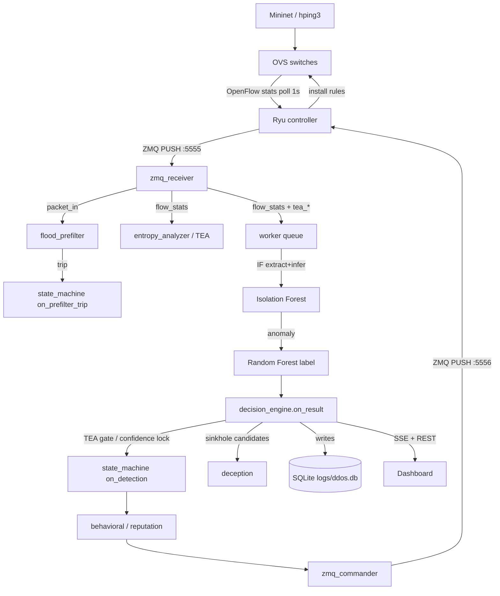

# Architecture

## End-to-end data flow

## Component wiring (backend/main.py `create_app()`)

`backend/main.py` is the only place singletons get connected. Order matters:

1. `loader.load_all()`: load IF + RF models and feature contracts from `models/`.
2. `get_connection()`: SQLite schema + migrations.
3. Wire singletons:
   - `state_machine.set_commander(commander)`: state machine can push OpenFlow commands.
   - `deception.set_commander(commander)` + `set_callbacks(escalate_fn, release_fn)`: sinkhole escalates into `state_machine.on_detection()`.
   - `state_machine.set_deception(deception)`: circular ref for sinkhole escalation.
   - `resource_guard.set_state_machine(...)` / `set_deception(...)`: now **no-ops** (backward compat).
4. Start background threads:
   - `start_tick_thread()`: 1s state-machine tick loop.
   - `resource_guard.start()`: 2s controller CPU/mem poll.
   - `monitor.start()`: system metrics ~1s.
   - `decision_engine.start()`: worker pool + result callback.
   - `zmq_receiver.start()`: telemetry ingestion (resilient to Ryu offline).
   - `writer.start_flush_thread()`: 5s `traffic_summary` batch flush.
   - `archiver.start()`: hourly hot→archive rotation.
5. Register blueprints: stats, ip_detail, graph, events, quarantine (mitigation), report.

`app.run(host, port, threaded=True, debug=False)`: `threaded=True` is required for SSE streaming alongside other endpoints.

## ZeroMQ bus (two sockets)

| Socket | Address | Direction | Payload |
|---|---|---|---|
| Telemetry | `tcp://127.0.0.1:5555` | Ryu **PUSH** → backend **PULL** | `switch_count`, `packet_in`, `flow_stats`, `dropped_delta` |
| Command | `tcp://127.0.0.1:5556` | backend **PUSH** → Ryu **PULL** | `reset`, `block`, `rate_limit`, `quarantine`, `clear`, `proto_block`, `warmup_done`, `redirect` |

> [!warning] Address sync
> The ZMQ addresses are **hardcoded in both** `controller/ryu_controller.py` and `backend/config.py`. They must stay in sync manually.

## Backend singleton objects

`state_machine`, `deception`, `resource_guard`, `commander`, `tracker`, `flood_filter`, `entropy_analyzer`: all module-level singletons created at import time, wired in `main.py`.

## Circular-import avoidance

Dependencies that form a cycle (e.g. `state_machine` → `decision_engine._sse_dedup`, `worker` → `decision_engine`, `resource_guard` → `commander`) are handled with **deferred imports inside functions** rather than module-level imports.

## Hardcoded topology knowledge (simulation-specific)

Attacker IPs `10.0.0.6-19, 22-27`, legit hosts `10.0.0.1-5`, whitelist `10.0.0.20/21` appear duplicated in `worker`, `decision_engine`, `zmq_receiver`, and `deception`. See [[known-issues/known-issues]].

## Related notes

- [[overview/project-overview]]
- [[backend/ml-pipeline]]
- [[backend/mitigation]]
- [[controller/ryu-controller]]